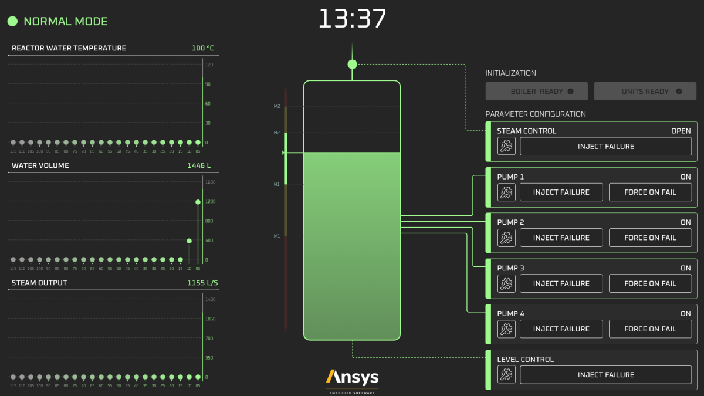

# Smart Boiler Control

The Smart Boiler Control application illustrates, how touch interactivity concepts are brought into control panel with a modern/futuristic smart boiler control panel. The  Smart Boiler Control application was automatically generated from SCADE Suite® and SCADE Display®.
The Smart boiler controller is software used to control the water level in a steam boiler. It is important that the program works correctly because the quantity of water present when the steam boiler is operating must neither be too low nor too high; otherwise, the smart boiler  in front of it could be seriously affected.

This project serves as a companion to the blog series, "Designing a Next-Gen Embedded HMI," which explores the concepts implemented =>  [SCADE Smart Boiler Control – Designing a next-gen embedded HMI](https://ansyskm.ansys.com/forums/topic/scade-smart-boiler-control-designing-a-next-gen-embedded-hmi/).

# Demo Architecture 
Description of the architecture of the demo.

# Demo Start Guide
Open SCADE Display project `model/scade-display/DisplayPanel.etp`

Select `Windows` configuration & execute.

For SCADE Test for Display, open SCADE Test project `model/scade-test/SmartBoilerControl_Test.etp` and execute Tests.
# Products used 

| Product          | Used       |
|------------------|------------|
| SCADE Suite      | **Yes** |
| SCADE Display    | **Yes** |
| SCADE Architect  | No |
| SCADE Test       | **Yes** |
| SCADE LifeCycle  | No |
| SCADE A661       | No |
| Medini Analyze   | No |
| TwinBuilder      | No |

