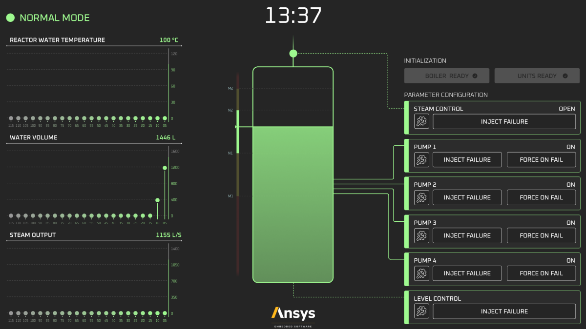

.. role:: raw-html-m2r(raw)
   :format: html

Smart Boiler Control
====================

:raw-html-m2r:``
:raw-html-m2r:``
:raw-html-m2r:``
:raw-html-m2r:``

The Smart Boiler Control application illustrates, how touch interactivity concepts are brought into control panel with a modern/futuristic smart boiler control panel. The  Smart Boiler Control application was automatically generated from SCADE Suite® and SCADE Display®.
The Smart boiler controller is software used to control the water level in a steam boiler. It is important that the program works correctly because the quantity of water present when the steam boiler is operating must neither be too low nor too high; otherwise, the smart boiler  in front of it could be seriously affected.

This project serves as a companion to the blog series, "Designing a Next-Gen Embedded HMI," which explores the concepts implemented =>  `SCADE Smart Boiler Control – Designing a next-gen embedded HMI <https://ansyskm.ansys.com/forums/topic/scade-smart-boiler-control-designing-a-next-gen-embedded-hmi/>`_.

Start Guide
===========

Generate, build and execute standalone application
--------------------------------------------------

Launch  SCADE Display and open the project ``model/scade-display/DisplayPanel.etp`` (File>Open). 

.. raw:: html

   

     
   

Select ``Windows`` configuration, this configuration enables the generation of a standalone application
running on Windows.

.. raw:: html

   

     
   

Then click Execute.

.. raw:: html

   

     
   

Test Execution on host
----------------------

Launch SCADE Test and open SCADE Test project ``model/scade-test/SmartBoilerControl_Test.etp`` (File>Open).

.. raw:: html

   

     
   

Project > Test tool > Execute tests

.. raw:: html

   

     
   

