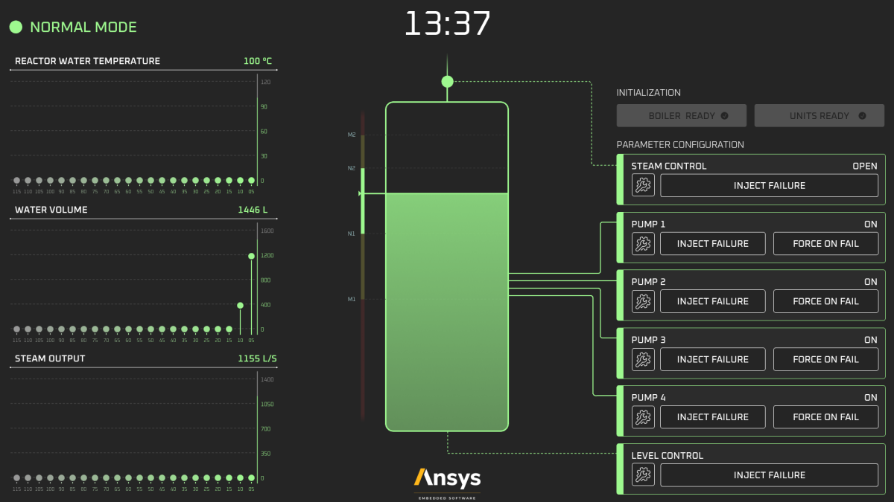

.. .. role:: raw-html-m2r(raw)
..    :format: html

Smart Boiler Control
====================
|scade| |scade-suite| |version| |license|

.. |scade| image:: https://img.shields.io/badge/Ansys-SCADE-ffb71b?labelColor=black&logo=data:image/png;base64,iVBORw0KGgoAAAANSUhEUgAAABAAAAAQCAIAAACQkWg2AAABDklEQVQ4jWNgoDfg5mD8vE7q/3bpVyskbW0sMRUwofHD7Dh5OBkZGBgW7/3W2tZpa2tLQEOyOzeEsfumlK2tbVpaGj4N6jIs1lpsDAwMJ278sveMY2BgCA0NFRISwqkhyQ1q/Nyd3zg4OBgYGNjZ2ePi4rB5loGBhZnhxTLJ/9ulv26Q4uVk1NXV/f///////69du4Zdg78lx//t0v+3S88rFISInD59GqIH2esIJ8G9O2/XVwhjzpw5EAam1xkkBJn/bJX+v1365hxxuCAfH9+3b9/+////48cPuNehNsS7cDEzMTAwMMzb+Q2u4dOnT2vWrMHu9ZtzxP9vl/69RVpCkBlZ3N7enoDXBwEAAA+YYitOilMVAAAAAElFTkSuQmCC
   :target: https://www.ansys.com/fr-fr/products/embedded-software/
   :alt: Ansys SCADE

.. |scade-suite| image:: https://tinyurl.com/2s498jkv
   :target: https://www.ansys.com/fr-fr/products/embedded-software/
   :alt: Ansys SCADE Suite, Display, Test

.. |version| image:: https://img.shields.io/badge/version-2024R2-blue
   :alt: version

.. |license| image:: https://img.shields.io/badge/License-MIT-yellow.svg
   :target: https://opensource.org/licenses/MIT
   :alt: MIT

.. :raw-html-m2r:``
.. :raw-html-m2r:``
.. :raw-html-m2r:``
.. :raw-html-m2r:``

Overview
--------
The Smart Boiler Control application illustrates, how touch interactivity concepts are brought into control panel with a modern/futuristic smart boiler control panel. The  Smart Boiler Control application was automatically generated from SCADE Suite® and SCADE Display®.
The Smart boiler controller is software used to control the water level in a steam boiler. It is important that the program works correctly because the quantity of water present when the steam boiler is operating must neither be too low nor too high; otherwise, the smart boiler  in front of it could be seriously affected.

This project serves as a companion to the blog series, "Designing a Next-Gen Embedded HMI," which explores the concepts implemented =>  `SCADE Smart Boiler Control – Designing a next-gen embedded HMI <https://ansyskm.ansys.com/forums/topic/scade-smart-boiler-control-designing-a-next-gen-embedded-hmi/>`_.

Requirements
------------
The ``ansys-scade-example-smart-boiler-control`` project supports only the versions of 
Ansys SCADE, starting from 2024 R2.

Documentation and issues
------------------------
Documentation for the latest stable release of Ansys SCADE Smart Boiler Control Example  is hosted at
`Ansys SCADE Smart Boiler Control Example documentation <smart-boiler-control.example.scade.docs.pyansys.com/version/stable/index.html>`_.

In the upper right corner of the documentation's title bar, there is an option for
switching from viewing the documentation for the latest stable release to viewing the
documentation for the development version or previously released versions.

On the `Ansys SCADE Smart Boiler Control Issues <https://github.com/ansys/scade-example-smart-boiler-control/issues>`_
page, you can create issues to report bugs and request new features. On the `Discussions <https://discuss.ansys.com/>`_
page on the Ansys Developer portal, you can post questions, share ideas, and get community feedback.

License
~~~~~~~
 Ansys SCADE Smart Boiler Control Example is licensed under the MIT license.

This toolkit makes no commercial claim over Ansys whatsoever. The use of this toolkit
requires a legally licensed copy of the Ansys SCADE Suite. For more information,
see the `Ansys SCADE Suite <https://www.ansys.com/products/embedded-software/ansys-scade-suite>`_
page on the Ansys website.